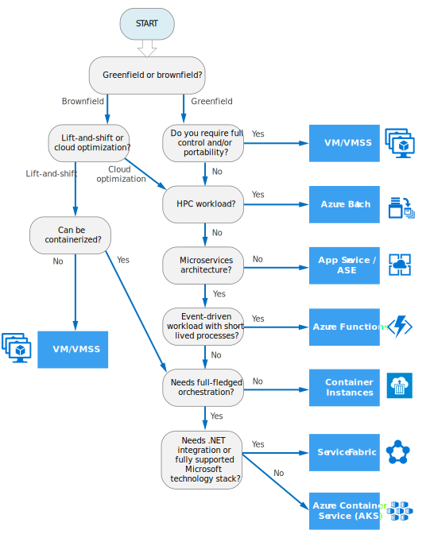

# Decision tree for Azure compute services

This flowchart guides you through a set of key decision criteria to a recommended Azure compute service. 
 

Every application has unique requirements, so you should treat the recommendation as a starting point. Then perform a more detailed analysis, looking at aspects such as:
 
- Feature set
- Service limits
- Cost
- SLA
- Regional availability
- Developer skillsets
- Developer ecosystem

If your application consists of multiple workloads, evaluate each workload separately. A complete solution may incorporate two or more compute services.