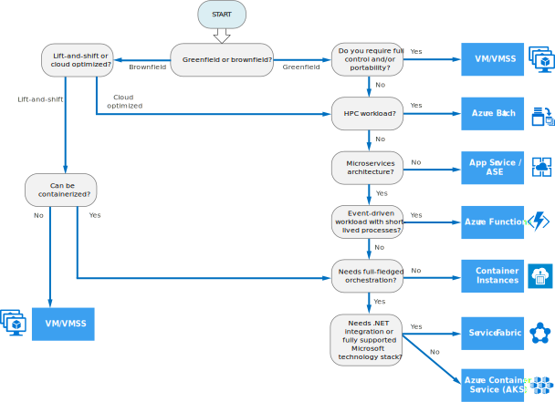

# Overview of Azure compute options

The term *compute* refers to the hosting model for the computing resources that your application runs on. 

At one end of the spectrum is **Intrastructure-as-a-Service** (IaaS). With IaaS, you provision the VMs that you need, along with associated network and storage components. Then you deploy whatever software and applications you want onto those VMs. This model is the closest to a traditional on-premises environment, except that Microsoft manages the infrastructure. You still manage the individual VMs.  

**Platform-as-a-Service** (PaaS) provides a managed hosting environment, where you can deploy your application without needing to manage VMs or networking resources. For example, instead of creating individual VMs, you specify an instance count, and the service will provision, configure, and manage the necessary resources. Azure App Service is an example of a PaaS service.

There is a spectrum from IaaS to pure PaaS. For example, Azure VMs can auto-scale by using VM Scale Sets. This automatic scaling capability isn't strictly PaaS, but it's the type of management feature that might be found in a PaaS service.

**Functions-as-a-Service** (FaaS) goes even further in removing the need to worry about the hosting environment. Instead of creating compute instances and deploying code to those instances, you simply deploy your code, and the service automatically runs it. You don’t need to administer the compute resources. These services make use of serverless architecture, and seamlessly scale up or down to whatever level necessary to handle the traffic. Azure Functions are a FaaS service.

IaaS gives the most control, flexibility, and portability. FaaS provides simplicity, elastic scale, and potential cost savings, because you pay only for the time your code is running. PaaS falls somewhere between the two. In general, the more flexibility a service provides, the more you are responsible for configuring and managing the resources. FaaS services automatically manage nearly all aspects of running an application, while IaaS solutions require you to provision, configure and manage the VMs and network components you create.

## Decision tree for choosing a compute option

<!-- 
Here are the main compute options currently available in Azure:

- [Virtual Machines](/azure/virtual-machines/) are an IaaS service, allowing you to deploy and manage VMs inside a virtual network (VNet).
- [App Service](/azure/app-service/app-service-value-prop-what-is) is a managed service for hosting web apps, mobile app back ends, RESTful APIs, or automated business processes.
- [Service Fabric](/azure/service-fabric/service-fabric-overview) is a distributed systems platform that can run in many environments, including Azure or on premises. Service Fabric is an orchestrator of microservices across a cluster of machines. 
- [Azure Container Service](/azure/container-service/container-service-intro) lets you create, configure, and manage a cluster of VMs that are preconfigured to run containerized applications.
- [Azure Functions](/azure/azure-functions/functions-overview) is a managed FaaS service.
- [Azure Batch](/azure/batch/batch-technical-overview) is a managed service for running large-scale parallel and high-performance computing (HPC) applications.
- [Cloud Services](/azure/cloud-services/cloud-services-choose-me) is a managed service for running cloud applications. It uses a PaaS hosting model. 

When selecting a compute option, here are some factors to consider:

- Hosting model. How is the service hosted? What requirements and limitations are imposed by this hosting environment? 
- DevOps. Is there built-in support for application upgrades? What is the deployment model?
- Scalability. How does the service handle adding or removing instances? Can it auto-scale based on load and other metrics? 
- Availability. What is the service SLA? 
- Cost. In addition to the cost of the service itself, consider the operations cost for managing a solution built on that service. For example, IaaS solutions might have a higher operations cost.
- What are the overall limitations of each service? 
- What kind of application architectures are appropriate for this service? 

-->

For a more detailed comparison of compute options in Azure, see [Criteria for choosing an Azure compute option](./compute-comparison.md).